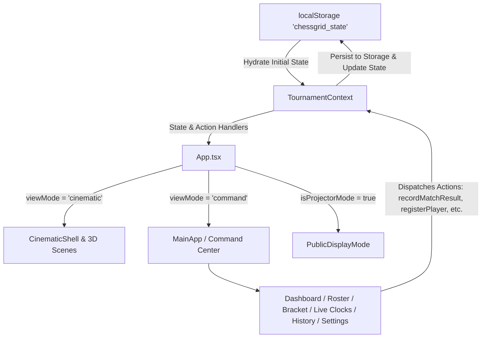

# Project Context — ChessGrid

## 1. Executive Summary
**ChessGrid** is a specialized, responsive collegiate chess tournament management application featuring:
1. An immersive **3D Cinematic Landing Arena** rendered via Three.js / React Three Fiber with GSAP-driven scroll orchestration.
2. A high-efficiency **Tournament Command Center** designed for arbiters, tournament directors, and campus organizers to register players, generate single-elimination knockout brackets, manage live match clocks, enter results, record undo snapshots, and print official collegiate tournament reports.
3. A **Public Projector Display Mode** delivering a high-contrast scoreboard view for stage and projector broadcasting.

---

## 2. Technology Stack

| Layer | Technologies |
| :--- | :--- |
| **Core UI Framework** | React 19 (`react`, `react-dom`) |
| **Language & Tooling** | TypeScript 6, Vite 8 (`@vitejs/plugin-react`) |
| **Styling & Design System** | Tailwind CSS 4 (`@tailwindcss/vite`), Custom CSS Variables (`src/index.css`), Glassmorphism |
| **3D Rendering** | Three.js (`three`), React Three Fiber (`@react-three/fiber`), Drei (`@react-three/drei`) |
| **Animation & Effects** | GSAP (`gsap`), Canvas Confetti (`canvas-confetti`), Web Audio API sound synthesis |
| **Icons & Linter** | Lucide React (`lucide-react`), Oxlint (`oxlint`) |

---

## 3. Directory Structure

```
Chessgrid/
├── .antigravityignore               # Agent indexing filter rules
├── AGENTS.md                        # Persistent agent memory & rulebook
├── index.html                       # Base HTML shell with Google Fonts
├── package.json                     # Scripts & package dependencies
├── tsconfig.json                    # Root TypeScript config
├── tsconfig.app.json                # React TypeScript config
├── vite.config.ts                   # Vite bundler configuration
├── public/                          # Static icons & vectors (favicon.svg, icons.svg)
├── docs/
│   └── PROJECT_CONTEXT.md           # This document: architecture & module map
└── src/
    ├── main.tsx                     # React root initialization
    ├── App.tsx                      # Top-level view-mode router & modal hub
    ├── index.css                    # Obsidian/Gold design tokens & typography
    ├── types/
    │   └── tournament.ts            # Type definitions: Player, Match, Board, Settings, etc.
    ├── context/
    │   ├── TournamentContext.tsx    # Global tournament state machine & localStorage persistence
    │   └── ScrollContext.tsx        # Scroll-linked waypoint management for 3D camera
    ├── utils/
    │   ├── bracketEngine.ts         # Binary knockout bracket generation & winner routing
    │   ├── exportUtils.ts           # HTML/Print report generation & download
    │   ├── formatters.ts            # Time, score, round, and badge formatting helpers
    │   └── soundEffects.ts          # Web Audio synthesized sound manager
    ├── data/
    │   └── demoData.ts              # Pre-configured collegiate dataset for fast demo loading
    └── components/
        ├── cinematic/               # 3D Three.js scenes & scroll transitions
        │   ├── HeroScene.tsx        # 3D interactive chessboard & reflective pieces
        │   ├── BracketStructureScene.tsx # 3D wireframe bracket visualizer
        │   ├── PairingChamberScene.tsx   # 3D match face-off visualization
        │   ├── PlayerGalleryScene.tsx    # 3D player cards floating carousel
        │   ├── MatchArenaScene.tsx       # 3D board match arena
        │   ├── ChampionPodiumScene.tsx   # 3D podium and victory confetti
        │   ├── CinematicShell.tsx   # Master 3D canvas and scroll layout container
        │   └── LoadingScreen.tsx    # Initial luxury loading screen
        ├── dashboard/               # Command Center overview metrics & live widgets
        ├── bracket/                 # 2D Interactive knockout bracket tree
        ├── players/                 # Player roster table, profile, registration, & bulk import
        ├── matches/                 # Match listing, live cards, result entry, & undo modals
        ├── live/                    # Digital chess timers & arbiter board manager
        ├── eliminated/              # Eliminated player roster & 3-tier golden podium
        ├── history/                 # Match history audit logs & report export modal
        ├── projector/               # Full-screen venue projector display
        ├── settings/                # Tournament settings, rules editor & backup/restore
        ├── layout/                  # Command Center Navbar, Sidebar, and Footer
        └── common/                  # Toast container, confirm dialogs, and champion modal
```

---

## 4. State Management & Data Flow



### Core State Entities (`src/types/tournament.ts`)
- **`Player`**: Unique ID, seed, collegiate credentials (name, rollNumber, course, year, semester, section), tournament record (wins, losses, draws, score, status: `'registered' | 'active' | 'eliminated' | 'champion' | 'withdrawn'`).
- **`Match`**: Unique ID, round index/name, board assignment, white/black player IDs, winner/loser IDs, status (`'upcoming' | 'ready' | 'live' | 'completed' | 'cancelled'`), chess clock timers (ms remaining, active clock side), result type, and link references (`nextMatchId`, `previousMatchIds`).
- **`TournamentSettings`**: Name, college name, department, academic session, venue, total players (2..128), status, default time control, board count, and auto-advance toggle.
- **`HistoryLog`**: Action type, match ID, description, timestamp, and JSON `snapshotState` enabling complete undo capabilities.

---

## 5. Main Routes, View Modes & Modal Hub

Since ChessGrid is an SPA built for zero-latency tournament operations, routing is state-driven:

### View Modes (`src/App.tsx`)
1. **`LoadingScreen` (`viewMode === 'loading'`)**: Asset pre-warming and initial presentation.
2. **`CinematicShell` (`viewMode === 'cinematic'`)**: Multi-scene 3D landing presentation with floating nav and "Enter Command Center" CTA.
3. **`MainApp` (`viewMode === 'command'`)**: Tabbed Command Center navigation:
   - `'dashboard'`: Tournament metrics, round progress bar, active boards, announcements.
   - `'players'`: Searchable, filterable player table with seed badges and profile previews.
   - `'bracket'`: Knockout tree visualization with zoom/pan and live winner lines.
   - `'matches'`: Filterable match list with live statuses and quick result triggers.
   - `'live'`: Interactive dual-sided chess clocks with arbiter overrides.
   - `'boards'`: Physical table/board assignment matrix.
   - `'eliminated'`: Hall of Honor with round-by-round departure cards and podium.
   - `'history'`: Match logs, undo manager, and official print export.
   - `'settings'`: Config, collegiate rules editor, and JSON state backup/restore.
4. **`PublicDisplayMode` (`isProjectorMode === true`)**: Fullscreen scoreboard for stadium screens.

---

## 6. Major Reusable Components & Modals

| Component | File Path | Purpose |
| :--- | :--- | :--- |
| `ToastContainer` | `src/components/common/ToastContainer.tsx` | Global floating toast alerts for actions & notifications |
| `ConfirmDialog` | `src/components/common/ConfirmDialog.tsx` | Destructive action confirmation modal |
| `ChampionModal` | `src/components/common/ChampionModal.tsx` | Full-screen victory celebration with confetti |
| `PlayerRegistrationModal` | `src/components/players/PlayerRegistrationModal.tsx` | Form to create/edit individual players |
| `BulkImportModal` | `src/components/players/BulkImportModal.tsx` | CSV / TSV player list importer |
| `ManualPairingModal` | `src/components/bracket/ManualPairingModal.tsx` | Custom player bracket rearrangement and re-seeding |
| `MatchDetailsModal` | `src/components/matches/MatchDetailsModal.tsx` | Detailed match inspection modal |
| `ResultEntryModal` | `src/components/matches/ResultEntryModal.tsx` | Arbiter match outcome logger (win, draw, walkover, tie-break) |
| `UndoResultModal` | `src/components/matches/UndoResultModal.tsx` | Snapshot rollback modal to revert mis-recorded match results |
| `ExportReportModal` | `src/components/history/ExportReportModal.tsx` | Printable PDF/HTML tournament standings and bracket export |

---

## 7. Development & Verification Commands

```bash
# Start local development server with Vite HMR
npm run dev

# Run TypeScript typecheck and production build
npm run build

# Run fast static analysis linter
npm run lint

# Preview production build locally
npm run preview
```

---

## 8. Critical Constraints & Conventions
1. **No Source Code Regression**: Do not alter tournament scoring formulas or bracket progression trees without verifying seed calculations in `src/utils/bracketEngine.ts`.
2. **Strict Glassmorphism Aesthetic**: Use theme variables (`--cg-obsidian`, `--cg-gold`, `--cg-ivory`, `--cg-emerald`) and established typography classes.
3. **State Persistence**: All tournament changes must flow through `TournamentContext` dispatch functions to maintain `localStorage` synchronization and undo snapshots.
